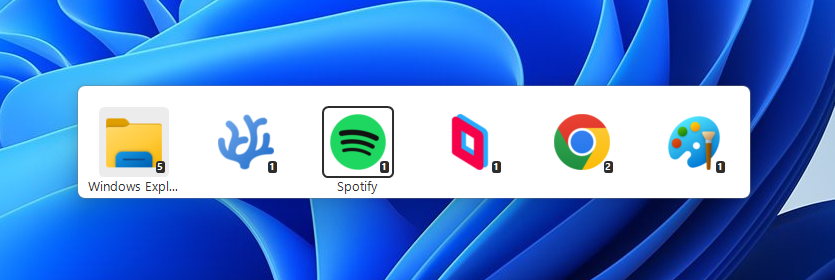

## AltAppSwitcher: alternative application switcher for Windows

Main features:
- Minimalist icon based interface
- MacOS-like or Gnome-like application switching. Use `alt + tab` to select the active app (not window) and `alt + ~` to switch between windows of the active app.
- MacOS-like application switching can be disabled if you prefer Windows style.
- Customizable keybindings and display options

**Tested on Windows 10 and Windows 11.**

## Launching AltAppSwitcher:
Get the archive from the [release page](https://github.com/hdlx/AltAppSwitcher/releases/).

**x86_64** and **ARM64** (AArch64) architectures are available. Please note that I was not able to test the ARM64 one myself.

**Run the `AltAppSwitcher.exe` (preferably as an administator).**

Close the application using `CloseAltAppSwitcher.bat` file.

## Run at startup:
Run `AddToStartup.bat` to add AltAppSwitcher to Windows startup apps.

Run `RemoveFromStartup.bat` to revert this.

## Customization
**"Settings"** executable lets you change settings such as **key bindings**, **theme**, **scale** and **mouse support**.

## Known issues
- Alt tab popup is behind start menu.
- Releases might be flagged as malicious by antiviruses. This is a false positive (detection relies on machine learning).

## Building from source
This is a C project relying on C standard library and Windows API. I'm using [Clang (mingw)](https://github.com/mstorsjo/llvm-mingw) and VS Code / VS Codium.
Here is my setup:
### Dependencies:
- **Clang and Windows libraries:**\
Download **Clang MinGW**, unzip and add `Bin` subfolder to "Path" so `clang` (and other tools from MinGW) can be called from a terminal.\
I'm using `llvm-mingw-20240619-msvcrt-x86_64` from [Clang (mingw)](https://github.com/mstorsjo/llvm-mingw) at the time of writing.
- **Python:**\
Download **Python** and install or add to "Path" so `python` can be called from a terminal.\
Alternatively, you can use MinGW-provided Python under `Python/bin`.
- **Make**\
Make is part of MinGW.
- *(Optional) mt.exe:*\
To deploy (Makefile `deploy` target), we need Microsoft's `mt.exe`. This tool is used to embed manifest in exe. The application runs fine with external manifest (when not using Makefile `deploy` target). `mt.exe` is part of the Windows SDK.
### Building:
- Clone the repository.
- Open a terminal at the root of the repository.
- Run `mingw32-make.exe` (MinGW make must be used)
- Binaries are found in `/Output/Debug_x86_64`
### Debugging:
I'm using VSCodium/VSCode to write and debug code, with 2 extensions:
- https://open-vsx.org/extension/vadimcn/vscode-lldb for debugging
- https://open-vsx.org/extension/llvm-vs-code-extensions/vscode-clangd for language server integration (code completion, errors...)
  
With those, you should be able to build and run inside VSCode using the configurations defined in `.vscode\launch.json` (at the moment, configurations are written for x86_64 but you can easily create arm64 equivalent)

Configurations refers to tasks defined in `/.vscode/tasks.json`
