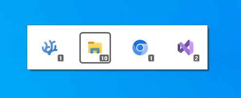

This program brings MacOS-like application switching to Windows. Use `alt + tab` to select active app (not window) and `alt + ~` to switch between windows of the active app.

**Tested on Windows 10 and Windows 11.**

## Using MacAppSwitcher:
Get the executable (Win64 only) from the release page https://github.com/hdlx/MacAppSwitcher/releases/.
You can kill it from the task manager. Search for "MacAppSwitcher".

## Known issues
- Missing installer or instructions to have MacAppSwitcher launching on system startup.
- Alt tab popup is behind start menu.

## Technology
This is a C project relying only standard library and Windows API. I'm using GCC (mingw) and VS Code / VS Codium.
